# Flight Arrival Delay Prediction II

### Info
- **Module:** Principles of Machine Learning
- **Tools Used:**
  - Microsoft Azure Machine Learning Studio
  - Microsoft Excel
- **Assets:**
  - [_images_](./images) folder (Misc. image files)

---
### Description  
----
This project is a continuation of the [Flight Arrival Delay Prediction](https://github.com/Cydol/DS-Project3) project.

Further steps are performed to improve the accuracy of the Regression machine learning model in order to predict the arrival delay of flights more accurately.

---
### Background
---
To recap, ***Flights Delay Data*** dataset is a built-in dataset in Azure ML platform that contains flight-related information for USA airports in the year 2013. This include info such as the time (year, month, day of month), carrier, origin and destination airports of the flights, as well as whether they were on-time, early or late. 

Flight arrival delay prediction is useful for airports, airlines, and passengers as it allows them to plan and prepare for potential delays and to make informed decisions about travel plans.

---
### Sample Work
---
**Project Workflow**  

Applying the principles of machine learning, several steps are performed in the final machine learning phase in order to improve the accuracy of the Regression machine learning model.

##
- **Metrics used for Evaluation of Model**

A few different Regression machine learning models are investigated to determine which is the most suitable and the following metrics are used to evaluate them:

**1. Coefficient of Determination**

This is also known as the R-Squared or Adjusted R-Squared value (for multiple independent
variables) and is the proportion of the variation in the dependent variable that is predictable
from the independent variable(s).

It is a value from 0 to 1 with a value of 1, meaning all variation in the dependent variable can
be explained by the independent variables. It can be thus taken as the accuracy of the model.

**2. Root Mean Squared Error (RMSE)**

It measures the average difference between values predicted by a model and the actual values.
In other words, it is the standard deviation of the residuals. In general, the lower the ***RMSE***
value (minutes in this case), the closer the predicted arrival delay value is to the actual arrival
delay which also means the more accurate the model is.

**Current Model Metrics**

From the previous project, ***Boosted Decision Tree Regression*** model was used with the default settings and the following metrics were achieved:

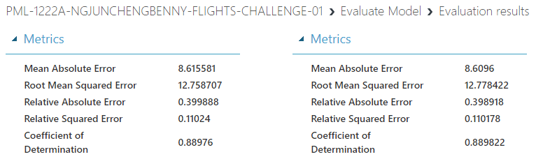

***Coefficient of Determination (Testing Data):*** 0.89  
***Root Mean Squared Error (Testing Data):*** 12.8 minutes

To improve the accuracy of the model, the goal is to increase the ***Coefficient of Determination*** value to higher than 90% (preferably closer to 95%) as well as to reduce the ***Root Mean Squared Error*** to below 10 minutes.

##
- **Comparing Regression Algorithms**

Different Regression algorithms with the default settings are used to compare their performance
metrics to determine which is the most suitable one to be used.

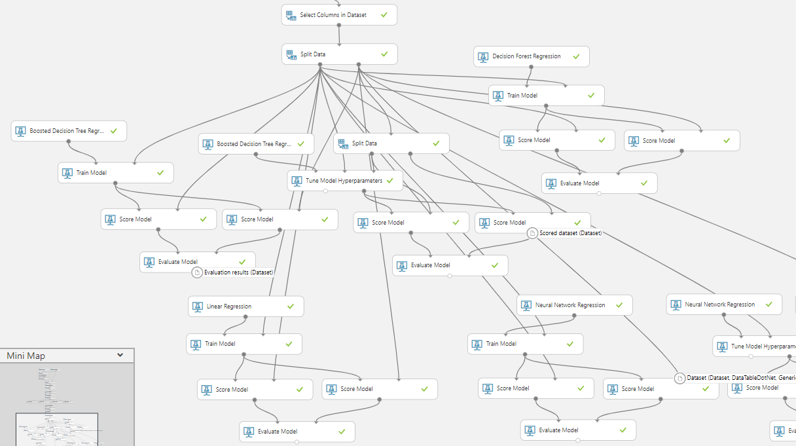

**Linear Regression**

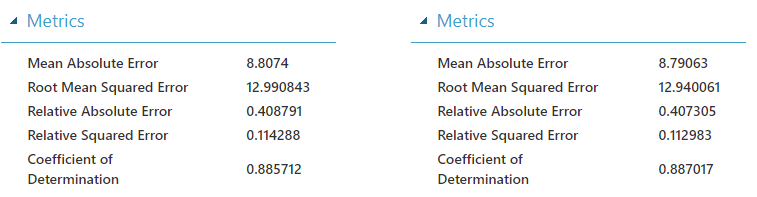

**Decision Forest Regression**

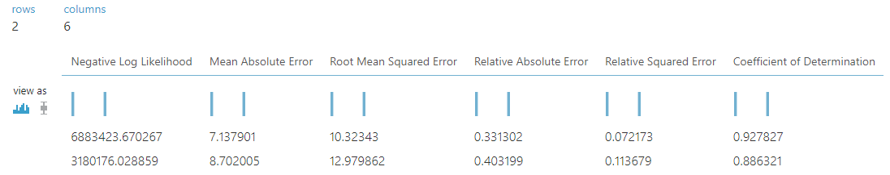

**Neural Network Regression**

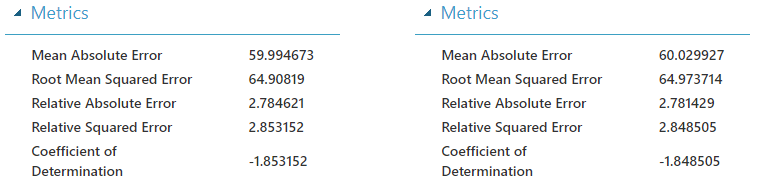

**Model Evaluation Metrics (Testing Data):**

| **Regression Model**    | **Root Mean Squared Error** | **Coefficient of Determination** |
| :---   |  :---  | :---  |
| Boosted Decision Tree Regression | 12.78 minutes | 0.889 |
| Linear Regression | 12.94 minutes | 0.887 |
| Decision Forest Tree Regression | 12.98 minutes | 0.886 |
| Neural Network Regression | 64.97 minutes | -1.848 |

In conclusion, the original ***Boosted Decision Tree Regression*** model performed the best with the highest ***Coefficient of Determination*** value as well as the lowest ***Root Mean Squared Error*** value.

Even though ***Linear Regression*** model and ***Decision Forest Regression*** model have similar
performance, the original ***Boosted Decision Tree Regression*** model is chosen because the model is clearly non-linear for majority of the independent features (only ***DepDelay*** is linearly related to the ***ArrDelay***). ***Decision Forest Regression*** model takes more time and resources to build (since many decision trees are created).

##
- **Feature Selection**

Next, the feature importance is investigated to determine if the number of features used in the model can be reduced to reduce its complexity.

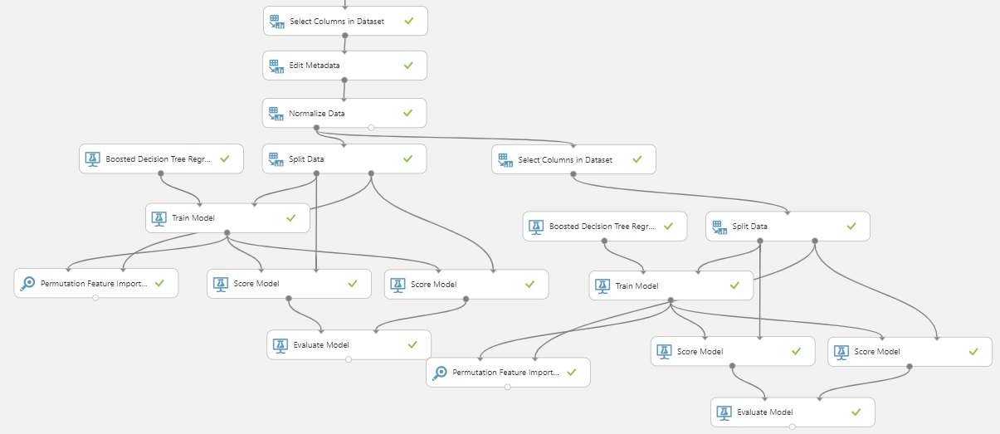

After investigation, the conclusion is that even though several features with small weight values can be removed without affecting the accuracy of the model too much, this is not performed as the accuracy of the model will still be decreased by a little. The model can be made less complicated but since the accuracy of it will be decreased, none of the independent features are removed.

##
- **Treatment of the Outliers**

From the data visualization created previously, it can be observed that ***DepDelay*** has a strong linear relationship with ***ArrDelay***, but there are noticeable outliers in the data (at the bottom where ***DepDelay*** has big values for when ***ArrDelay*** is 0, and the wide range of values for ***ArrDelay*** for when ***DepDelay*** is 0).

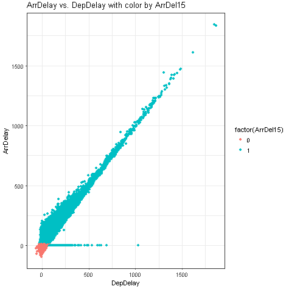

***Apply SQL Transformation*** module is used to clamp the values of the outliers to a smaller range (the difference of ***ArrDelay*** from ***DepDelay*** is kept to between a range of -15 and 15 minutes).

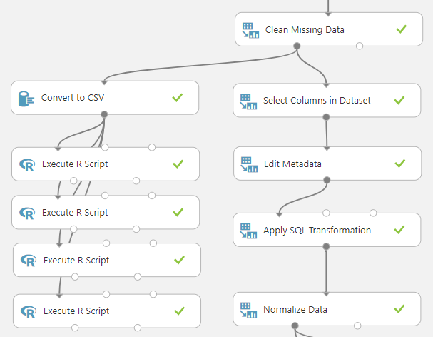

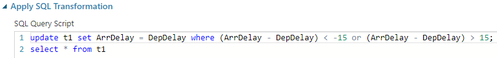

##
- **Hyperparameters Tuning and Cross Validation**

***Tune Model Hyperparameters*** module is used to do a random sweep over a range of parameters
specified for the ***Boosted Decision Tree Regression*** to find a set of good values for the
hyperparameters for the model.

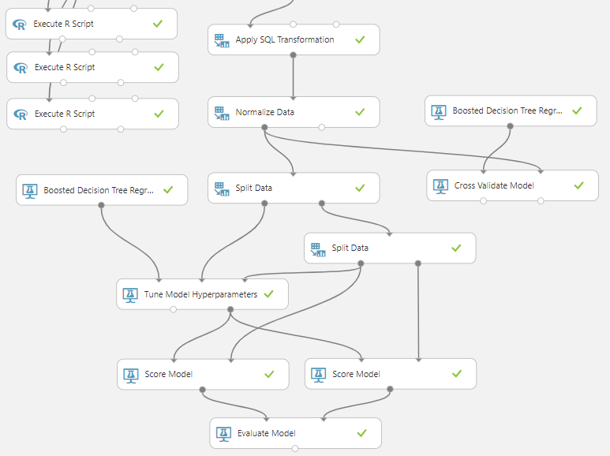

**Model Evaluation:**

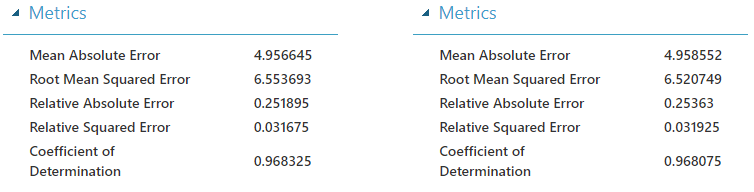

With the obtained optimal values of the hyperparameters, the final improved model (for Testing data) has a ***Coefficient of Determination*** value of 96.8% and a ***Root Mean Squared Error*** value of 6.52 minutes.

Finally, ***Cross Validate Model*** module is used to perform cross validation and as can be seen from below, the model performs well (with little bias) and is expected to perform well for unseen data with high accuracy and low ***RMSE*** value.

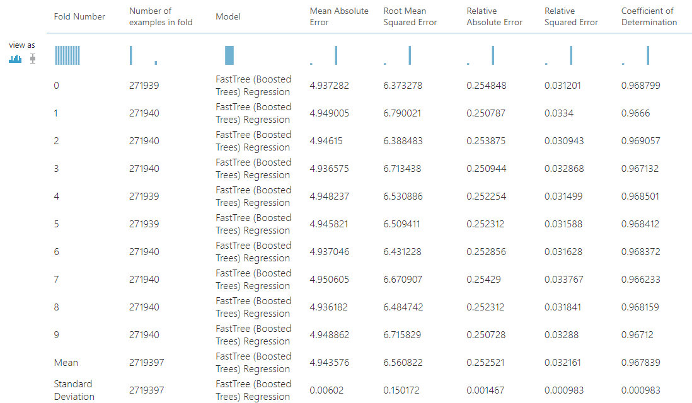

##
- **Publish the Model as Web Service and Test the Model**

The final experiment is created after removing the unnecessary components and is subsequently
published as a web service to be used.

**Final Predictive Experiment:**

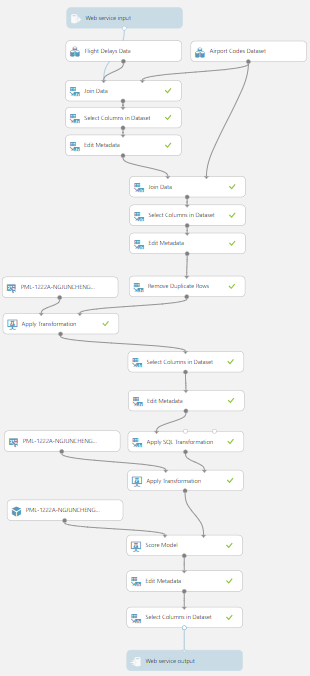

A score of 21 out of 25 is obtained (84% accuracy) when testing the model with the provided test data.

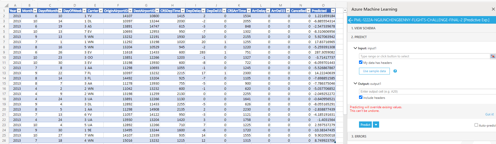

---
### Conclusion
---
Steps are performed to increase the accuracy of a predicting machine learning model created using Microsoft Azure Machine Learning platform which can be used to predict the arrival delay of flights.